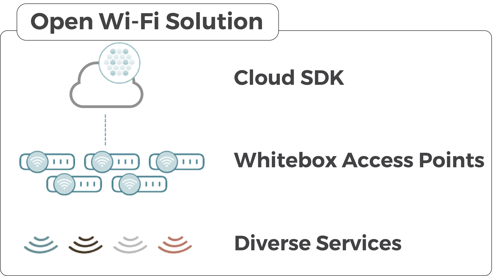

# Open Wi-Fi

## What is Open Wi-Fi?

TIP Open Wi-Fi is an open source community project that believes in democratizing premium Wi-Fi experiences for multiple market use cases. The TIP approach to Open Wi-Fi creates an open source disaggregated technology stack without any vendor lock in. Open Wi-Fi offers premium managed Wi-Fi features, local break-out design, cloud native open source controller, and an open source AP firmware operating system tested nightly. 

TIP Open Wi-Fi is the industry's first CI/CD open source Wi-Fi eco-system. Built nightly with a strong community of Wi-Fi leaders, new features are unit tested in automated RF chambers and checked from cloud to ground for Wi-Fi performance and conformance. 

### High Level Features

#### Each Open Wi-Fi AP offers:

* Multiple topologies including Bridging, Virtual LAN, NAT Gateway, Local Breakout, Overlay 
* Multiple authentications including WPA, WPA2, WPA3, Enterprise Radius models
* Passpoint R1 and R2 Mobile Offload
* Zero Touch Provisioning 
* Captive Portal

#### Cloud SDK in Open Wi-Fi offers:

* Zero Touch Provisioning 
* Integration Northbound Interface \(NBI\) RESTful
* Data model driven API 
* Template based device provisioning with RADIUS profile management 
* Advanced RF control with RRM  

  
**Open Wi-Fi AP Detail List:**

* IEEE 802.11b/g/n/ac/ax
* Wi-Fi 5 and Wi-Fi 6 Drivers
* Dual Bank Bootloader
* Multi-SSID per Radio
* SSID Authentications: WPA/WPA2/WPA3 - Mixed, Personal, Enterprise
* Un-Authorized Device Control
* 802.1Q VLAN per SSID 
* 802.1d Bridge Mode per SSID
* RADIUS Accounting, Interim-Accounting, NAS-IP, CUI
* Network Address Translation Gateway Mode Operation
* Network Time Protocol Client
* Management VLAN 
* IEEE 802.11ax Wi-Fi 6 Specific
  * WMM Admission Control per WFA Standard
  * BSS Coloring
  * UL/DL OFDMA sub-carrier allocation
  * Channel Switch Announcement
  * WMM Power Save
* IEEE 802.11 General Features

  * Beacon Rate 
  * IEEE 802.11h DFS & TPC 
  * Min Client Noise Immunity
  * Basic Rate Control
  * De-Auth RSSI Control
  * IEEE802.11ai Fast Initial Link Support
  * Burst Beacon Support
  * Per SSID Client Rate Limiting
  * Promiscuous Mode Support
  * IEEE 802.11e WMM Upstream/Downstream Queues & L3 DSCP
  * IEEE 802.11e Over The Air QoS EDCH Procedures
  * IEEE 802.11e WMM-PS \(Power Save\)
  * IEEE 802.11e UAPSD \(Unscheduled Power Save\) Procedures
  * IEEE 802.11r Fast BSS Transition
  * IEEE 802.11v Network Assisted Roaming
  * IEEEE 802.11k Client Radio Resource Management - Directed Steering
  * IEEE 802.11w Management Frame Encryption
  * IEEE 802.11h Channel Switch Announcement \(CSA\)
  * IEEE 802.11h Dynamic Frequency Selection & Transmit Power Control \(DFS/TPC\)

  \*\*\*\*

* **Additional TIP AP NOS Features**
  * Embedded Captive Portal \(Local Splash non-auth\)
  * Link Layer Discovery Protocol \(LLDP\)
  * Airtime Fairness
  * Wireline & Wireless Tracing \(PCAP Cloud Remote Troubleshooting\)
  * Synthetic Client \(Cloud Remote Troubleshooting\)
  * Flight Recorder \(Stack Remote Collection\)
  * Local Provisioning over SSID \(when Cloud or WAN down\)
  * Multimedia Heuristics \(Detection of Unified Communication Sessions\)
  * SSID Rate Limiting
  * Inter-AP Communication \(Client - Session Signalling\)
  * Client / AP / Network Metric Telemetry \(MQTT\)

**Cloud SDK additional features**

* **Provisioning** 
  * Device Identity \(Model, MAC, Serial Number\)
  * AP Software Upgrade
  * Profile Provisioning Templates
  * Multiple SSID Configuration
  * Bandwidth Rate Control per SSID
  * Multi-Radio 2.4/5GHz control
  * AP Network Mode Control \(Bridge/NAT mode\)
  * Basic Captive Portal \(Local Splash Page admin from Controller\)
  * Security \(WPA-Personal/WPA & WPA2/3 Personal Mixed/WPA & WPA2/3 Enterprise Mixed/WPA2/3 Personal/WPA2/3 Enterprise/WEP\)
  * VLAN per SSID
  * NTP Enable/Disable
  * RTLS \(Location Services\) Enable/Disable 
* **RF Control**
  * IEEE802.11r Fast BSS Transition per Radio Control
  * IEEE802.11k RRM Radio Information per Radio Control
  * IEEE802.11v Network Assisted Roaming per Radio Control
  * RRM Location AP Channel Table Provisioning
  * RRM Location AP Cell Size Table Provisioning
  * RRM Location Client Steering Threshold Table Provisioning 
* **Remote Troubleshooting and Service Assurance**
  * Syslog 
  * Synthetic Client
    * Remote DHCP, RADIUS, UE Network Analysis 
  * Remote Shell 
  * Remote Packet Capture Analysis

### **How to contribute**

If you or your company are interested in contributing to TIP Open Wi-Fi, please join the Wi-Fi Product Group by visiting [Telecom Infra Project](https://telecominfraproject.com/apply-for-membership/) to become a member.   

