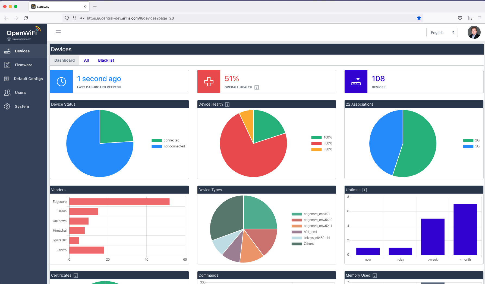

# OpenWiFi SDK

The TIP OpenWiFi SDK supports multiple hardware platforms for Wi-Fi and PoE switching. Commercial controllers are also integrating the OpenWiFi SDK with their go to market offers. This presents great opportunities for many operators. A full SDK for those who seek to work directly with the Open Source project to a full commercial vendor - operator model.

The OpenWiFi SDK provides a web UI for OpenWiFi administrators. The OpenWiFi UI shows all running services and configurations You can optionally show provisioning, management, and analytics for active deployed networks. All device interactions occur southbound using the OpenWiFi Gateway service. The Gateway implements the uCentral interface standard.

Subscriber self care is possible at a per-end-customer level. This provides an end-customer a view of their own premises with the ability to configure common settings of their devices.

All inter-service and NBI relationships are OpenAPI 3.0 compliant.

You can integrate OSS/BSS (Operations Back Office Support Software) systems with the OpenWifi SDK as a high performance provisioning and device management system.

## Device Dashboard

The SDK dashboard shows all devices deployed, their current state, and simplified reports of overall device health.

