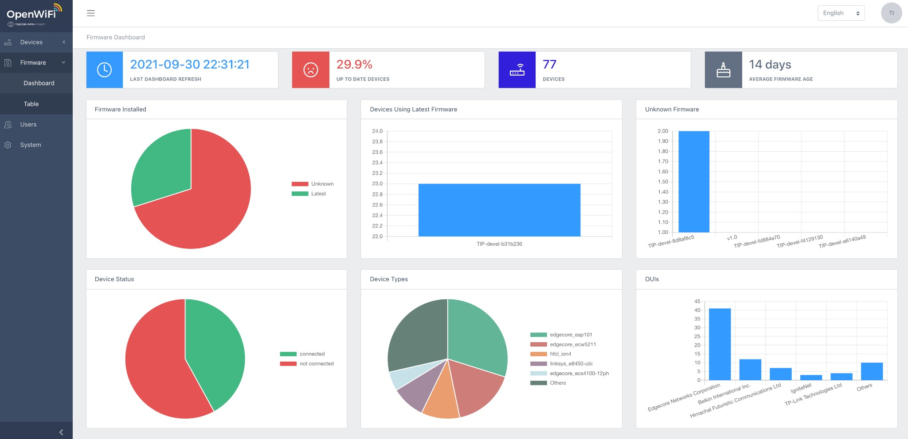

# Firmware Management

One of the highest management costs for operators is delivering firmware to the production network.

TIP OpenWiFi provides an out-of-the-box firmware management service—controlled using the Firmware dashboard or the firmware API.

