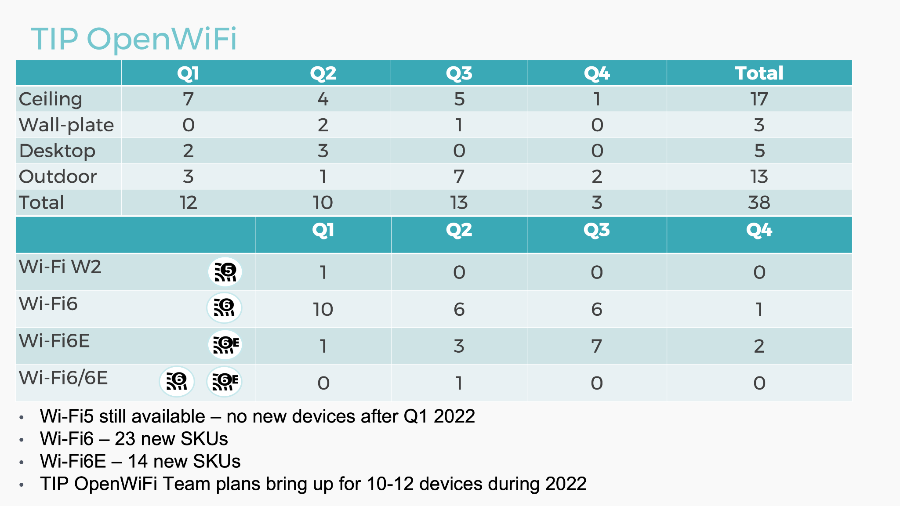

# Hardware Platforms

TIP OpenWiFi supports Wi-Fi 5 (802.11ac), Wi-Fi 6 (802.11ax) and Wi-Fi 6E (6GHz 802.11ax) in a mix of indoor and outdoor, ceiling to wall, desk, pole and strand environments.

For TIP OpenWiFi, a mix of ODMs deliver a diverse portfolio including CIG, Actiontech, EdgeCore, Cybertan, Wallys, Lindsay, HFCL and Inventum.

## Supported Hardware

The table below lists the supported hardware.

