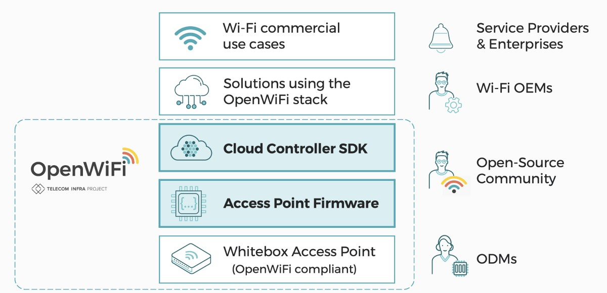
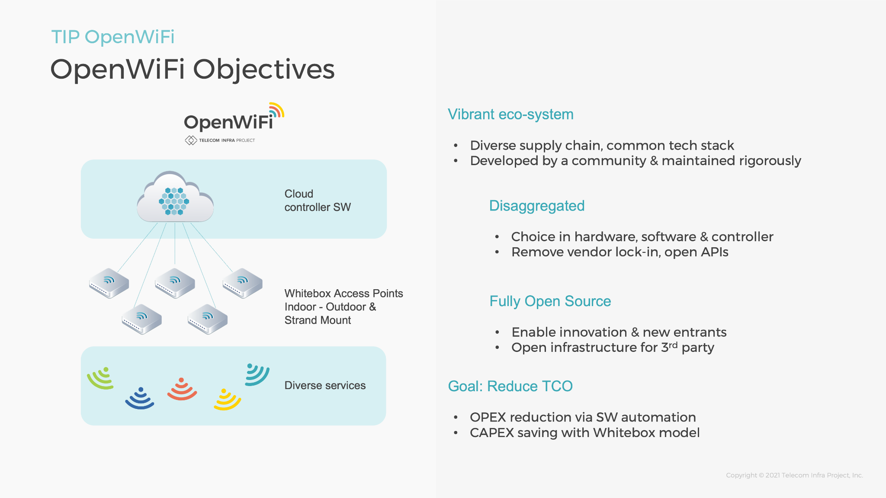

# About TIP OpenWifi

## Moving OpenWifi. Further.

Meta Connectivity provides solutions leveraging the Telecom Infra Project (TIP) OpenWiFi ecosystem—as part of the TIP Open Converged Wireless Project Group.

Established in Q42019, the TIP OpenWiFi solution goal has been to break vendor lock-in through disaggregation architectures, open APIs—with common embedded software and management that is both community- and commercially-supported.

Available for use as a completely Open Source reference, ODM vendors can easily adopt TIP OpenWiFi platforms as either a complimentary addition to hardware offers or as an entirely TIP OpenWiFi based hardware offer.

Vendors and operators can use the community project as a complete solution, extend the software stack based on design goals, or use only the components desired for deployment. The OpenWiFi community includes hardware ODM vendors, software DevOps, OEM, and System Integrators.

For more information on Telecom Infra Project and the Open Converged Wireless - OpenWiFi initiative please visit: [https://telecominfraproject.com/openwifi/](https://telecominfraproject.com/openwifi/)

TIP OpenWiFi is a community-developed, disaggregated Wi-Fi software system, offered as free open-source software that includes a cloud SDK and an enterprise-grade Access Point (AP) firmware, designed and validated to work seamlessly together.

## Forward Looking

There is much that could be done with OpenWiFi and Meta Connectivity Leads are moving forward. The alignment of how to introduce advanced services for Wi-Fi or as we term it Network Slicing for Wi-Fi as a Service, could help enable a much deeper end-to-end view of subscriber, service, and quality.

Ideally the outcome is the subscribers service follows them with the network—dynamically adjusting to this request—as opposed to today's model of the subscriber following the network using fixed provisioning.
