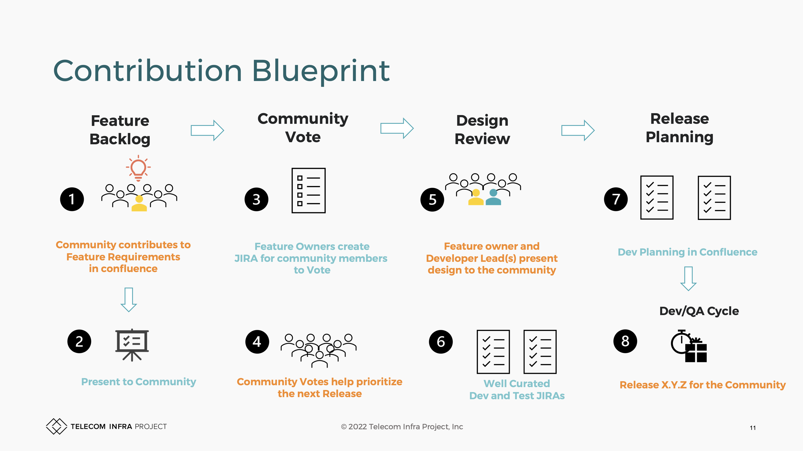

# Contributing

<figure><figcaption>
Current Contribution Model
</figcaption></figure>

Our community feature intake process is outlined [here](https://telecominfraproject.atlassian.net/wiki/spaces/WIFI/pages/1710358564/OpenWiFi+Requirements).

These feature backlog are then used to create release buckets. Our community release planning is outlined [here](https://telecominfraproject.atlassian.net/wiki/spaces/WIFI/pages/1660551173/OpenWiFi+Release+Planning).
