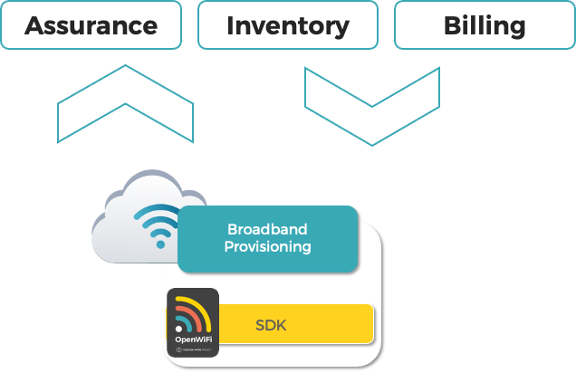

# Example Partner Integrations

You can extend deployment opportunities using third-party integrations with the TIP OpenWiFi SDK. For example, with third-party integrations, you can create a controller of multiple services. The services can include device provisioning, firmware management, network management, service assurance, subscriber authentication, captive portal services, IoT and amenity networks all commonly deployed across the MDU market. All of these traditional functions are supported in part by the OpenWiFi [API ](../developer-resources/api/)and [Telemetry](../developer-resources/sdk-kafka/) data from the OpenWiFi SDK.

## Integration by Vertical

### Service Provider Access

The simplest SDK integration is to integrate operator OSS/BSS systems for device provisioning, firmware management, and telemetry reporting.

In this scenario, the operator back office systems including and not limited to assurance and monitoring, inventory management and billing systems, will integrate with the OpenWiFi API and message bus interfaces of the SDK.

In service provider access, commonly non-fixed subscribers are served using the same technologies present in WLAN Controllers however the network may be provisioned to direct such traffic to stand alone appliances or applications including authentication (AAA) and walled garden / captive portal systems. TIP OpenWiFi systems support such variations.

TIP OpenWiFi is a local-breakout based approach therefore user traffic is not multiplexed through the SDK, the native local network provides access for the provisioned and billed use. For operators who do wish to aggregate subscriber traffic to a Wireless Access Gateway (WAG) the AP NOS has multiple network encapsulation options to choose from.

### WLAN Controller

WLAN controllers typically expose network visibility, subscriber management including authentication, roaming and RRM control, visualization of per Wi-Fi client performance including client session information, client session throughput, client session quality. Most controllers will implement some SON functionality where managing RF resources and channel planning are provided centrally at the controller and pushed across the managed WLAN.

While TIP OpenWiFi is a local breakout enabled solution, vendors who wish to aggregate all subscriber traffic through the WLAN Controller should provision the use of one of the AP NOS supported network encapsulations.

### Network Access Controller

Another model that is found in venue, enterprise and some service providers is a Network Access Controller (NAC). The NAC often appears as a decoupled controller where service assurance is less visible such as SON or RRM with focus instead on security, captive access, authentication of nomadic and or BYoD (Bring Your own Device) control.

In scenarios where the deployment is a venue, hotspot or service provider, the NAC will also offer a payment gateway enabling the solution to monetize network access. Common to the NAC solution is the ability to manage various headless devices, IoT elements, and provide DPI (Deep Packet Inspection ) capabilities based on knowledge of the Wi-Fi client, device type, how it authenticated and from where in the network it currently resides. These systems may be inline or more preferably out-of-band based and in the latter is where integration to the SDK is intended for synchronizing provisioned Wi-Fi devices via the SDK with authentication and security offerings of the NAC platform.

Device provisioning occurs through the SDK, which in turn includes provisioning of Virtual Access Point (VAP) to direct authentication to the NAC. Subscriber device authentication traffic arrives at the NAC which manages this according to the operator defined policies. In the case of a captive portal, NAC systems typically include portal redirection that may be WISPr based, or Coova based and some may include Passpoint support.

## Integration by Partner

TIP OpenWiFi has a diverse and rich ecosystem of members who solve a number of operator deployment and subscriber service challenges. In each of these cases and for any integrator, all the types of SDK integration are possible via APIs and message bus paths.

### JoinDigital

JoinDigital is an MDU Managed Service Provider. Within the JoinDigital portfolio are Small Medium Business (SMB) customers served as part of an MSP for the entire building. JoinDigital offers all the services a building requires including security, amenity networks, IoT integration, subscriber / tennant vlan management, hotspot services for common areas and more.

JoinDigital is an example of an MDU managed service provider who leverages their own OSS/BSS systems much the way a service provider would provide broadband provisioning of subscriber services. As such, JoinDigital integrated their existing billing, network management, assurance and inventory with the SDK directly.

### Indio Networks

Indio offers a diverse range of wireless network solutions for service provider and venue operator markets. They serve markets worldwide for Wi-Fi management, hotspot and IoT solutions.

Indio WiOS cloud platform was integrated with the SDK to bring device provisioning, firmware management and telemetry into the WiOS cloud management platform. This enabled Indio to simultaneously offer support for their own hardware devices running OpenWiFi in addition to the full range of platforms available via all the ODM partners, all possible from the WiOS interface. In this model Indio appears to OpenWiFi as a disaggregated WLAN Controller when integrated to the SDK offering a variety of wireless features.

### EdgeCore

EdgeCore provides a WLAN Controller that is more closely aligned to the enterprise or venue market. There are features such as hotspot enablement, and built-in subscriber authentication with strong focus on Wi-Fi quality both in AP device and subscriber client device. Dashboards offer strong service and network management capabilities with integration to the SDK at the device provisioning, firmware management and telemetry level.

### Lindsay Broadband

Lindsay Broadband is a direct supplier to the Cable MSO industry. A strong focus on outdoor wireless and wireline products, Lindsay has been enabling Wi-Fi in particular from the Cable MSO aerial strand for years. As the Cable MSO exhibits the service provider model of OSS/BSS integration to device provisioning, it has been simple for Lindsay to define a solution using just the SDK with support from the ecosystem.

The cable strand device has been hardware engineered to include a TIP OpenWiFi industrial based board offering Wi-Fi services for venues and mobile offload use cases.

Lindsay is currently manufacturing several dozen strand based devices for their customer trials of OpenWiFi.

For the Cable MSO deployment, the MSO OSS/BSS system is involved from the standpoint of network management and device provisioning integration to the SDK. The MSO may complement the subscriber management and services offered by adding NAC style out of band captive portal systems integrated via the SDK in addition to enabling OpenRoaming and Passpoint services for mobile offload and secure client access.

###
