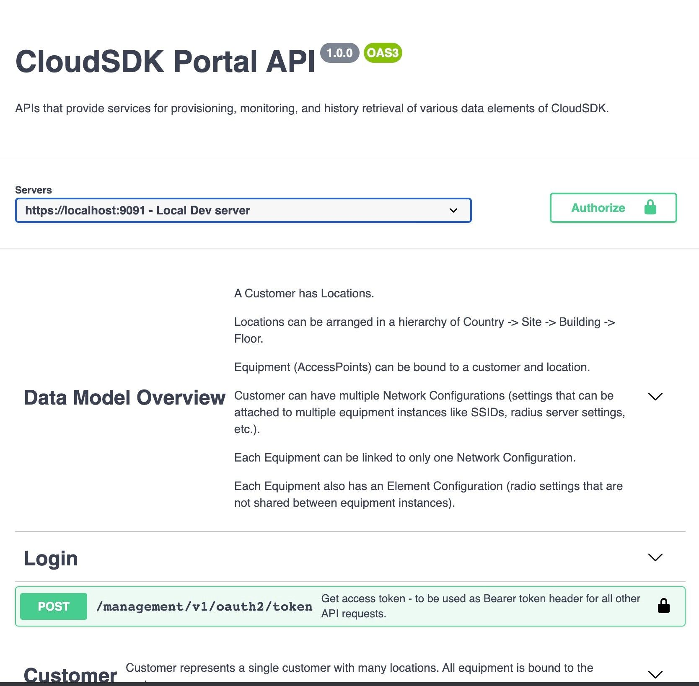

# Cloud SDK Open API and Swagger

TIP Open Wi-Fi controller implements an Open API compliant NorthBound Interface \(NBI\) to assist with integration and related back office features.  

Swagger is a useful tool to explore and learn any system API. Running a local Swagger instance requires a current version of NodeJS installed.

### Online Cloud SDK Open API 

Current SDK open API is available at the following URL:  [CloudSDK Open API](https://l.workplace.com/l.php?u=https%3A%2F%2Fapi.lab.wlan.tip.build%2F&h=AT2qj4RJnFaxruxpxP2s8O-XjRQMEbCC7aoVbHaHxmOxgfOgi5LHv6lWdCU4aV8x2vJcsxGmY-UKxb8W86xaDH-VtVLomBcBkdEHVxlpssluOoSPiIMC-vXU0NtGW44qktgKDJc934Dl2kr0QnRyZw)

### Obtain latest TIP Controller Open API data model

When running a local instance of Swagger, first obtain the most current Cloud SDK open API from source control:



#### Install Swagger

```text
mkdir ~/swagger
cd ~/swagger
git clone https://github.com/swagger-api/swagger-editor.git
cd swagger-editor
git clone https://github.com/swagger-api/swagger-ui.git
cd ~/swagger/swagger-editor
npm install
npm run build
npm start
```

With Swagger running, open the Open API data model file and begin to use locally on port 9091 or add your own TIP Open Wi-Fi controller to the Swagger definitions. Remember to obtain an [OAuth bearer ](./#curl-request-to-controller-for-bearer-token)token to 'Authorize' your session. 




