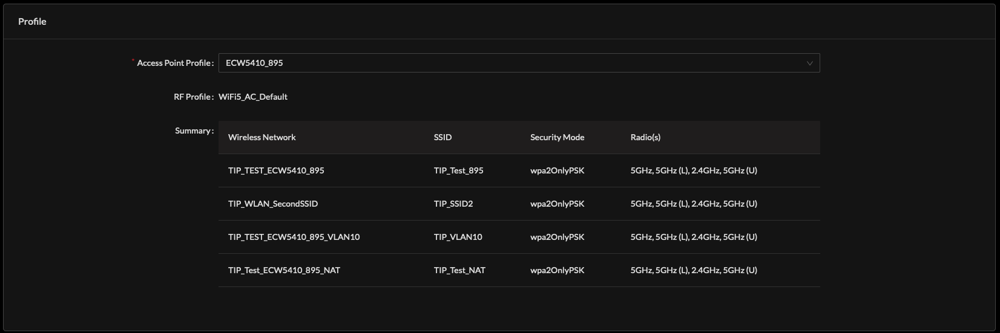

# Access Point

### Access Point Profile 

TIP SDK will process a 1:1 \(one to one\) or 1:Many \(one to many \) association of Access Point Profile offering a number of possible configuration approaches. 

When configuring in a 1:1 approach, it is advised to name the Access Point Profile in a manner meaningful to the deployment, for example Profile Name including significant OUI information. 

When configuring in a 1:M approach, it is advised to name the Access Point Profile in a manner meaningful to the shared service, RF parameters or grouped function all Access Points of this Profile will inherit. 

Within the Access Point Profile, RF configuration all device members will share is specified. 

One or many SSID Profiles may be associated to the Access Point Profile.

### Access Point

Relationship of RF Profile and Access Point Profile is visible in the Network, Access Point device record. 

Example inherited Profiles to an Access Point device:

