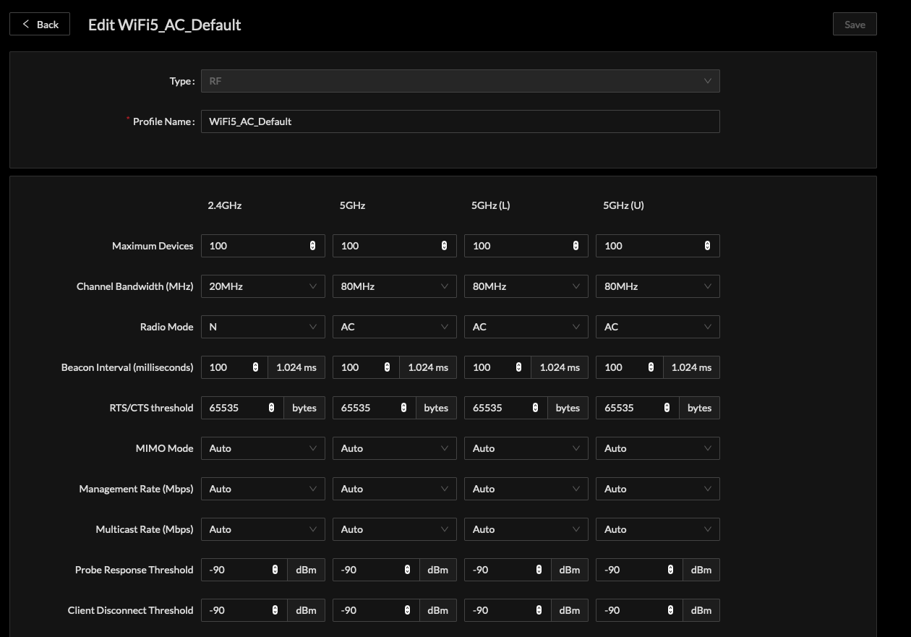
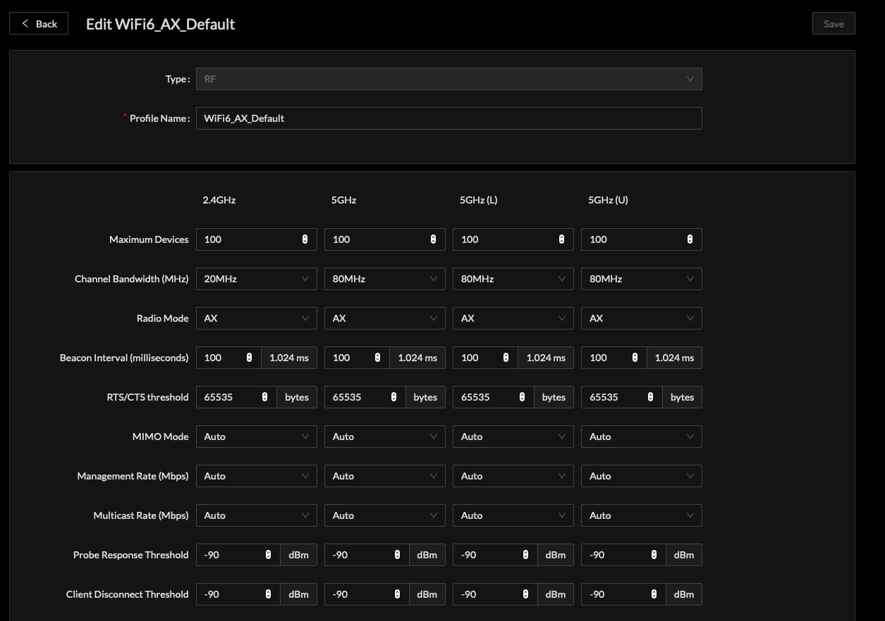

# Basic Device Provisioning

Cloud SDK processes Profiles by aggregating certain profile types as child profiles inherited during device configuration.

<table>
  <thead>
    <tr>
      <th style="text-align:left">Profile</th>
      <th style="text-align:left">Provisioning Role</th>
    </tr>
  </thead>
  <tbody>
    <tr>
      <td style="text-align:left">RF</td>
      <td style="text-align:left">Radio Operations</td>
    </tr>
    <tr>
      <td style="text-align:left">Access Point</td>
      <td style="text-align:left">
        
LAN &amp; GRE Configuration

        
Association to RF Profile

        
Association to SSID Profile

      </td>
    </tr>
    <tr>
      <td style="text-align:left">SSID</td>
      <td style="text-align:left">Service Set Identifier Wireless Network Operations</td>
    </tr>
  </tbody>
</table>

Association of devices to Access Point and SSID is possible as one-to-one \(1:1\) or one-to-many \(1:M\).  
The decision on using 1:1 or 1:M is entirely based on the desired deployment.

Creating a 1:1 Access Point Profile could be useful in certain lab or specific network locations. If a specific RF Profile was desired on a select device, using an Access Point Profile with reference to the specific RF Profile would accomplish this provisioning logic.

Creating an RF Profile specifically for IEEE802.11ac Wi-Fi 5 Access Points to inherit may be a common approach with another RF Profile for all IEEE802.11ax Wi-Fi 6 Access Points. Another reason to create a unique RF Profile may configured outdoor RF configuration that is unique from other indoor based Access Points.

Creating RF Profile with specific Client Steering, Channel Hop, or general radio operation other than default settings are useful when defining behavior of Access Points individually or as a large group of managed devices.

## Wi-Fi 5 802.11AC Mode General RF Profile

Example Wi-Fi 5 IEEE802.11AC RF Profile:

## Wi-Fi 6 802.11AX Mode General RF Profile

Example Wi-Fi 6 IEEE802.11AX RF Profile

