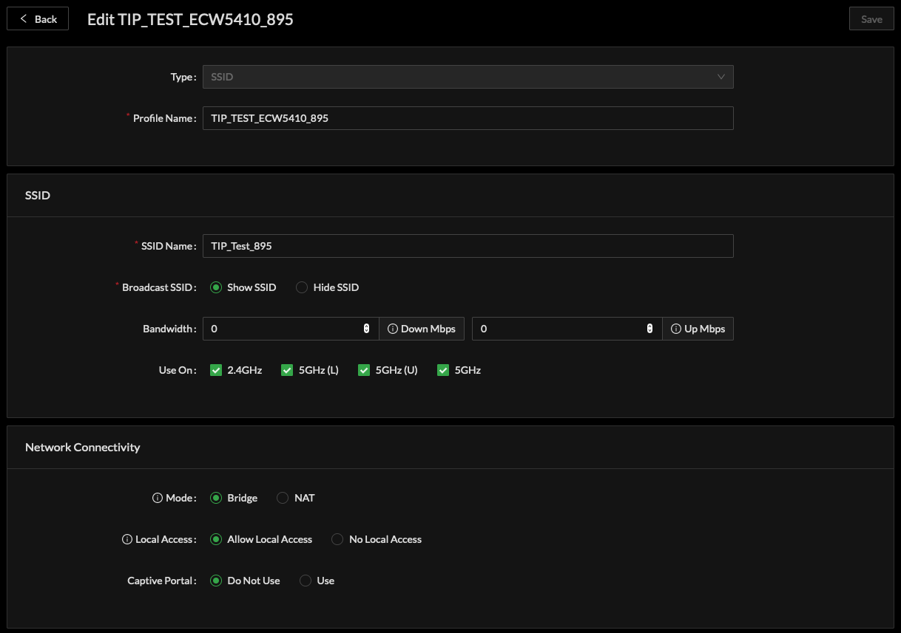

# Bridge Mode SSID

### Bridging Wi-Fi to Ethernet

When bridging an SSID this has the affect of moving the SSID virtual interface from the 'LAN' side of an Access Point to the 'WAN' side of an Access Point. 

Bridging SSID is configured within Profiles, SSID Profile:

* Create a Profile of type SSID
* Assign a Profile Name
* Create the SSID 
  * Assign SSID Name
  * Set related optional SSID parameters
* Network Connectivity
  * Ensure Mode is set to Bridge
* Security and Encryption
  * Set a Mode and related security for the SSID

