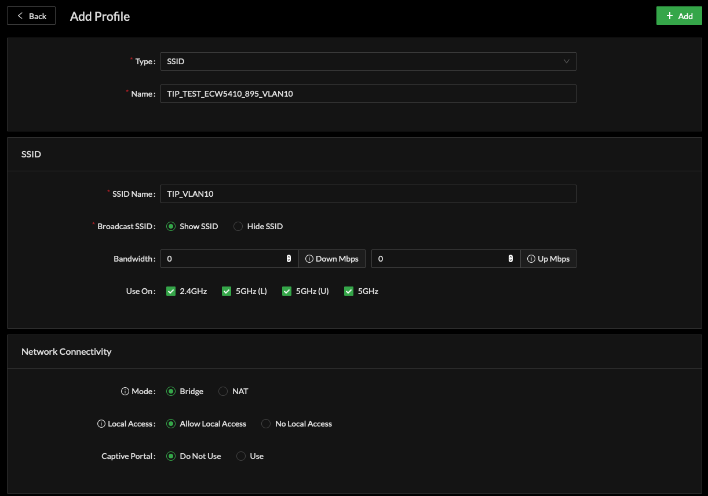
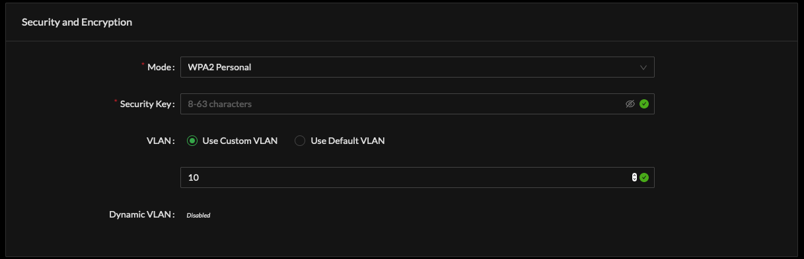
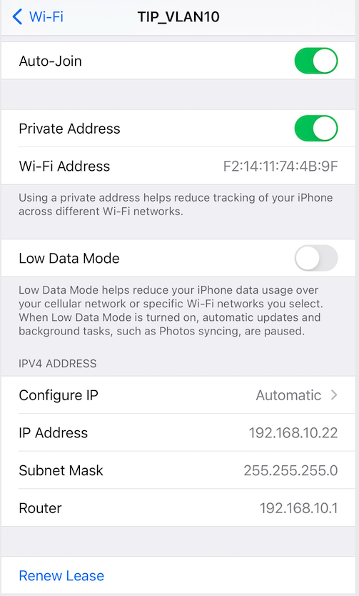

# Multi-VLAN SSID

### 802.1Q VLAN to 802.11 Wi-Fi SSID

When assigning an SSID to a VLAN, this has the affect of adding the Virtual LAN inner tag to the header of Ethernet frames once Wi-Fi client traffic reaches the Access Point for forwarding onward over Ethernet. 

The 'WAN' side of the Access Point will present an Ethernet sub-interface with the Virtual LAN identifier equivalent to VLAN set duing SSID creation.  

802.1Q VLAN SSID is configured within Profiles, SSID Profile:

* Create a Profile of type SSID
  * Assign a Profile Name
* Create the SSID 
  * Assign SSID Name
  * Set related optional SSID parameters
* Network Connectivity
  * Mode is set as Bridge
* Security and Encryption
  * VLAN is set to 'Use Custom VLAN'
    * Enter desired value from 2 - 4,095

Once the SSID Profile configured for a unique VLAN is associated to an Access Point, clients will receive DHCP, Routing, DNS from the Virtual LAN of the upstream network provider

