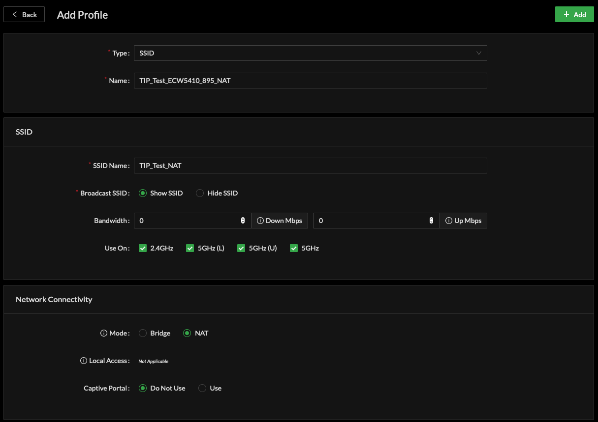

# NAT Gateway Mode SSID

### Network Address Translation Wi-Fi to Ethernet

When defining an SSID in NAT mode, this has the affect of isolating all SSID virtual interface traffic in Layer 2 and Layer 3 behind a NAT function inside the Access Point. 

The Access Point will use its 'WAN' interface as the public facing IP address for clients behind the SSID associated to NAT mode operation. 

NAT mode SSID will have a local DHCP service enabled by default with an address range of 192.168.1.0/24 where the first address is used by the Access Point as the SSID NAT LAN interface serving as default gateway address to all associated UE clients. 

NAT SSID is configured within Profiles, SSID Profile:

* Create a Profile of type SSID
* Assign a Profile Name
* Create the SSID 
  * Assign SSID Name
  * Set related optional SSID parameters
* Network Connectivity
  * Ensure Mode is set to NAT

