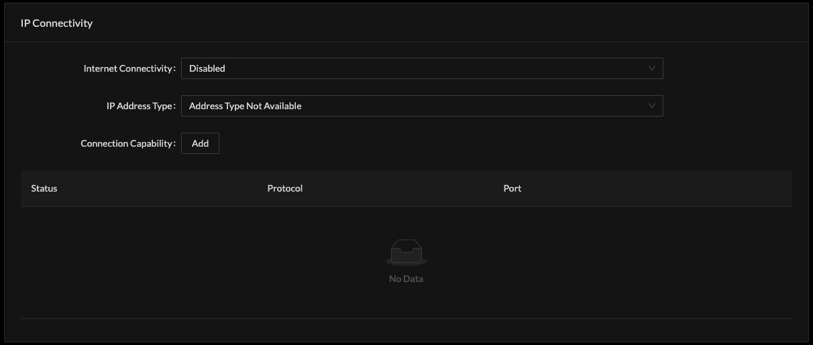

# Passpoint® via UI

Cloud SDK user interface enables all Passpoint® configuration needed for live service. 

Passpoint® services will combine multiple Cloud SDK Profiles. 

* RADIUS
* Passpoint
* Passpoint ID Provider
* Passpoint Operator
* Passpoint Venue

### RADIUS Profile

Add a RADIUS Profile, specify the IP address and shared secret and port required for reachability and authentication and accounting with the defined server\(s\). 

### Operator Profile - Venue 

Each Operator of Wi-Fi services or Venue must be defined. 

### Passpoint Operator 

### Passpoint ID Provider

Network Access Identifier \(NAI\) Realm implements all possible EAP methods for authentications. When adding EAP method, select the appropriate configuration to the deployment. 

### Passpoint Profile

Passpoint profile aggregates the other Operator / Venue, Identity Provider together, once joined to an SSID will be combined with RADIUS in terms of the Access Point processing logic for UE association and authentication. 

Add Passpoint Profile

Associate to the SSIDs of network service:

Advertise type of IP Connectivity

Advanced settings support ANQP Domain ID, GAS Behaviors and DGAF operation

