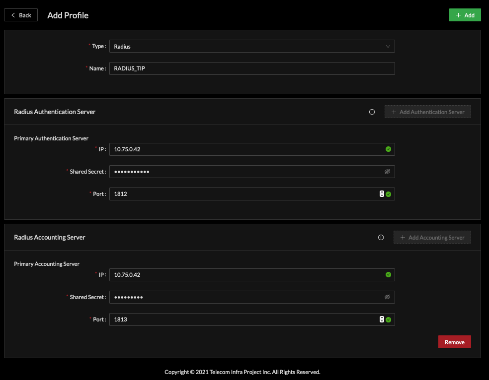
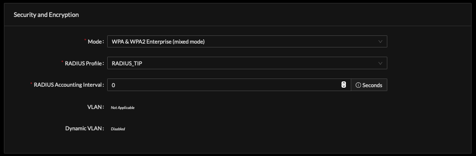

# RADIUS Authenticated SSID

A common deployment model is to use a RADIUS system for authentication of client devices. Cloud SDK supports this using a RADIUS type Profile. 

Defining a RADIUS Profile requires a Name, RADIUS server IP, shared secret and port. Default port for Authentication and Authorization is 1812 and Accounting is 1813. Cloud SDK does not assume these defaults, they must be entered as each deployment may choose to change these values. 

It is possible to configure independent authentication from accounting as these services may be unique for some operators. 

### Associate RADIUS with SSID Service

The RADIUS Profile is associated with a Security and Encryption Mode of an SSID Profile.   
For example, any Enterprise mode for WPA & WPA2 will depend on RADIUS. Select the desired RADIUS Profile from drop down and set the desired accounting interval in seconds. 

