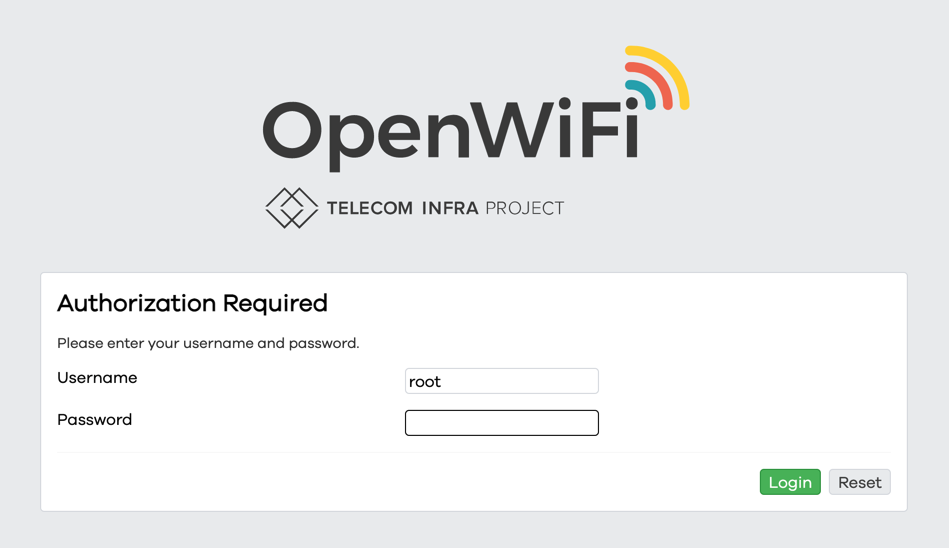
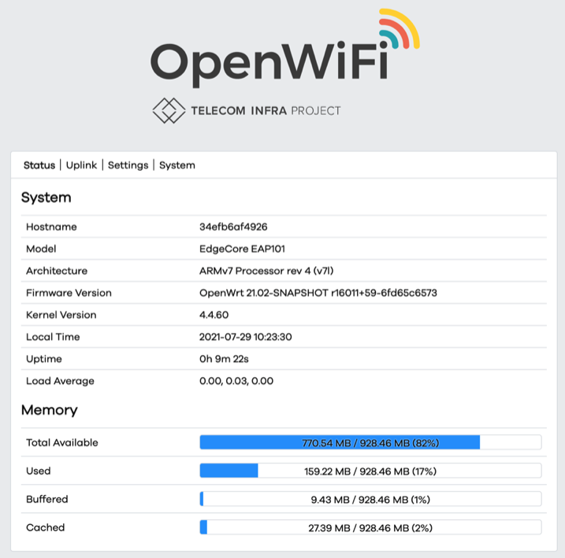
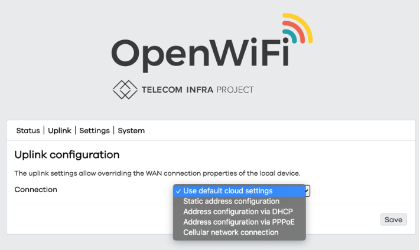
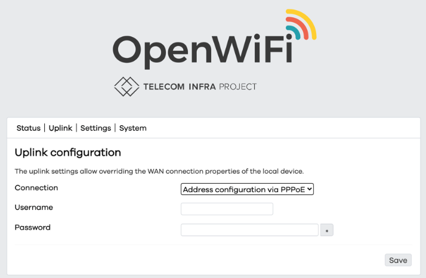
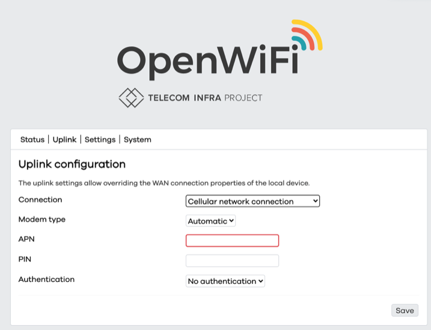
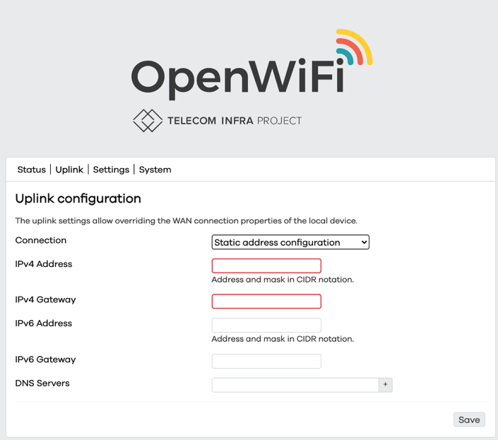
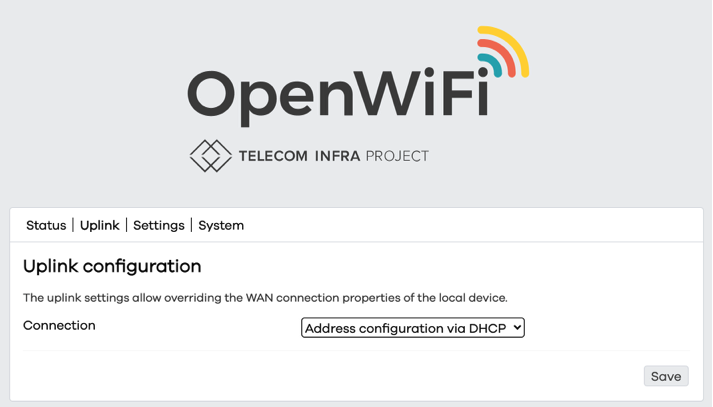
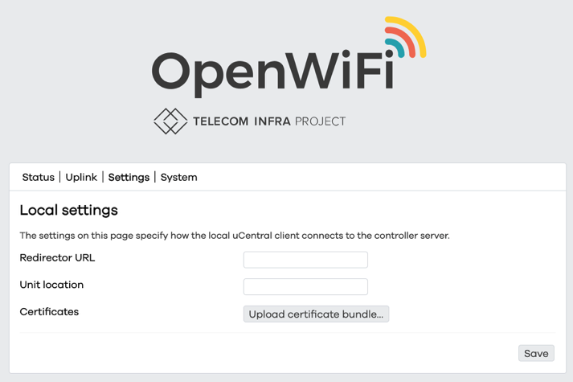
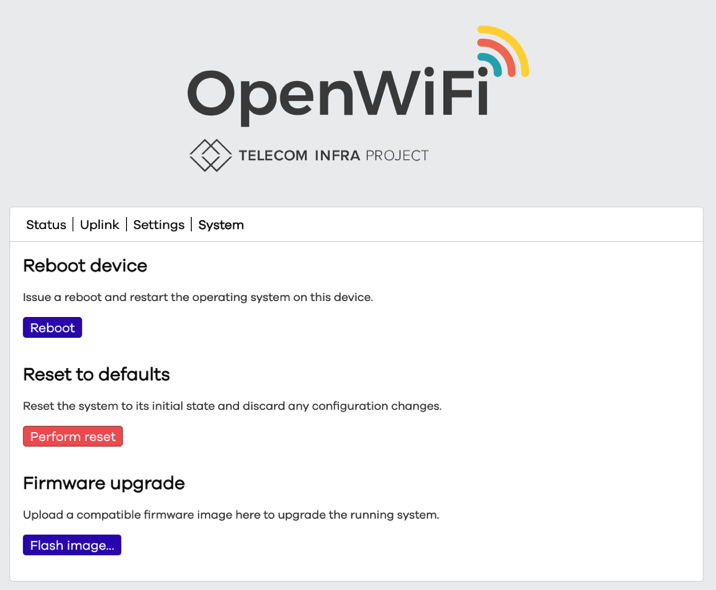

# Local Device Settings

When OpenWiFi devices are unable to connect to the cloud during their initial power on from factory, this may be a result of Internet connectivity issues. 

Certain WAN connections may require credentials such as a username and password or a mobile configuration or simply static address assignment instead of dynamic. 

OpenWiFi 2.0 supports these scenarios. When a device does not have an existing configuration and is unable to contact the cloud for provisioning it enters "Maverick" mode. 

For all Wi-Fi devices this means a Wi-Fi network with the SSID 'Maverick' will become available.   
Association with and logging in to the device will permit initial WAN connectivity to be entered. 

### Using Maverick

After association to the Maverick SSID, open a web browser to `http://192.168.1.1`   
Log into the OpenWiFi device with username: **`root`** and password: **`openwifi`**

When the page above is displayed, begin to configure Uplink based on the WAN requirements of the deployment.

If connection uses Point to Point over Ethernet \(PPPoE\) username and password credentials, enter those values and save.

If the OpenWiFi device has a Cellular connection which is possible on device models with 4G and 5G radios, the  network Access Point Name \(APN\) and PIN will be required. These values are supplied by your mobile network provider. 

When dynamic address allocation is not available, static IP address assignment may be required. IPv4 and IPv6 are supported, enter these values with DNS address and save. 

Otherwise leave the Uplink configuration to DHCP or cloud defaults. 

### Manual Redirector and Certificate Upload

If under rare circumstances it is not possible to discover the OpenWiFi cloud associated with the device or there is a need to replace device certificates, this may be configured in Settings.

### System

It is possible to reset the device to defaults, or locally update firmware using the commands available from System. 

\*\*\*\*

