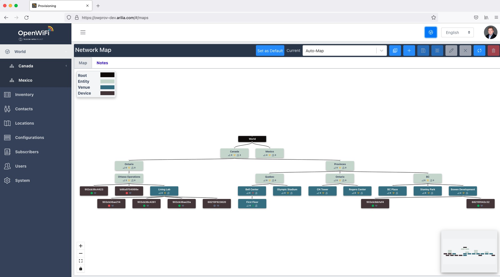
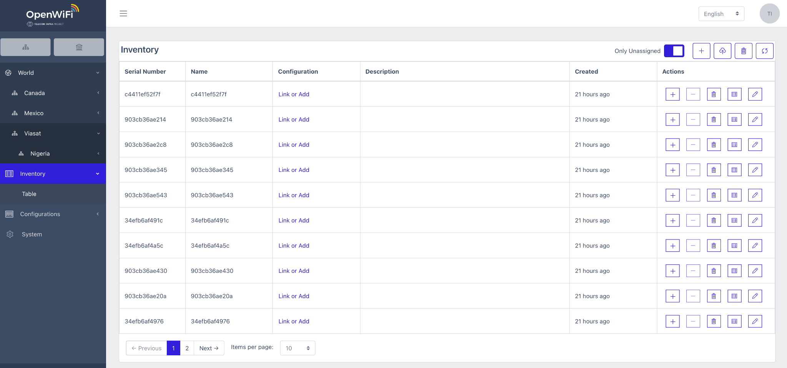
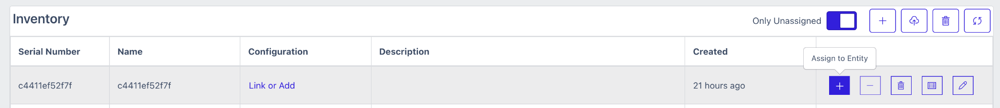
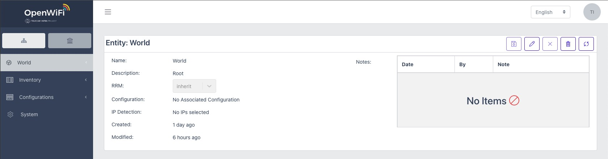
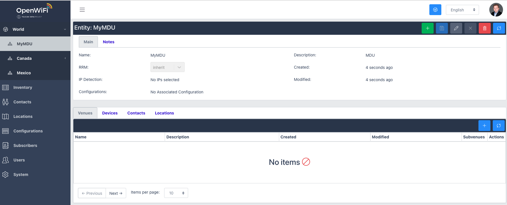
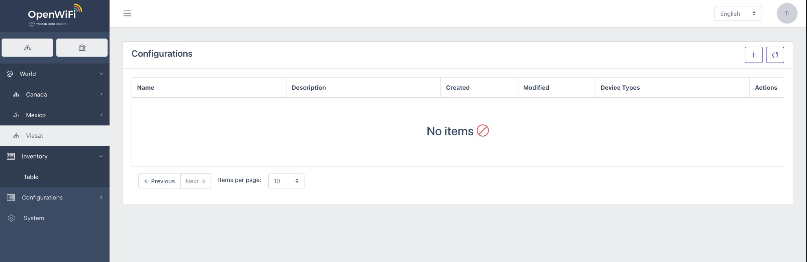
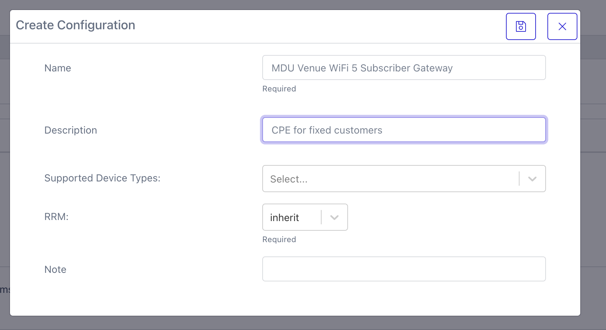
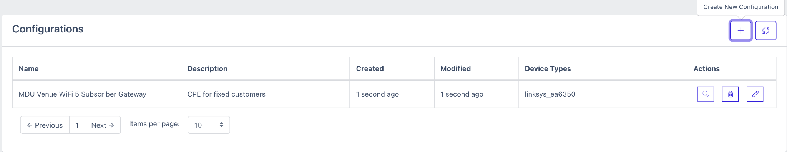

# About Device Provisioning

The OpenWiFi solution can be applied to a diverse number of use cases from enterprise networks, service provider access, and hotspots. OpenWiFi offers a variety of managed services from small to very large venues of roaming, client shared-key management, client steering, mobile offload, QoS-based services, and Layer 2 and Layer 3 breakout and overlay options. The Provisioning service provides a view into the network as a whole, and venues with entity-based control.

The provisioning service for OpenWiFi supports weighted order inheritance of configuration templates. These services and networks provide the greatest level of flexibility.

The system functions from a starting point of managed inventory assigned to entities, venues and optionally end subscribers. From this association, inheritance of entity, venue and subscriber configuration becomes possible where one to many configurations are processed including one to one when an inventory device such as a P2P link or Subscriber Gateway have unique operating data.

These features are present from the service over the web interface as well as via API for controller integration and OSS/BSS integration purposes.

Device provisioning is highly configurable and scalable.

## Inventory

You can manage device inventory for both assigned and unassigned states. As devices are added to the system, they become available to venues for association and service provisioning.

Each inventory record, regardless of assignment state can be viewed in the OpenWifi dashboard.

{width="6.4in" height="3.0in"}Use the SDK UI to assign a device to a venue, review device configurations, update record tags or delete a device.

### Bulk Inventory API

The TIP OpenWiFi inventory service API could be used to bulk load record formats in a common .csv structure using JSON. For example

\`\`\`

"SerialNumber",Name,Description,DeviceType,NoteText for example: d1300f7b0732,Manufacturer,Desc, edgecore\_spw2ac1200,OutdoorAP

\`\`\`

For each inventory record, the \`\`\`deviceType\`\`\` must match a valid OpenWiFi device type. For example:

\`\`\`

"deviceTypes": \[ "cig\_wf160d", "cig\_wf188", "cig\_wf194c", "edgecore\_eap101", "edgecore\_eap102",

"edgecore\_ecs4100-12ph", "edgecore\_ecw5211",

> ...]

\`\`\`

When inventory is assigned to a venue, it can be allocated into a top-level parent such as the operator. Then, based on role access, operation's teams may choose to assign the device to a child entity within an operating division, or setup the device as a tenant of a managed Wi-Fi service for example.

Choosing to assign the device to a specific MDU location as an example can be done in one step from above.

## Creating Entities and Venues

Devices can be assigned to the MDU—which may be an actual venue such as a building or a tenant operator with child venues.

## Provisioning Templates

Use the Create Configuration window to create a configuration template for a specific venue or device.

For example, a configuration template for a local area network could include: address translation and local DHCP for on-premises devices, WAN interface with DHCP for IPv4/IPv6 service, and a basic Wi-Fi configuration.
