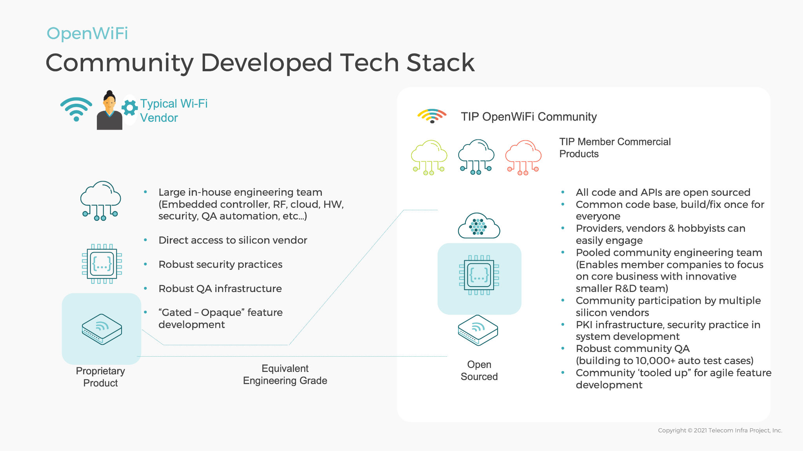
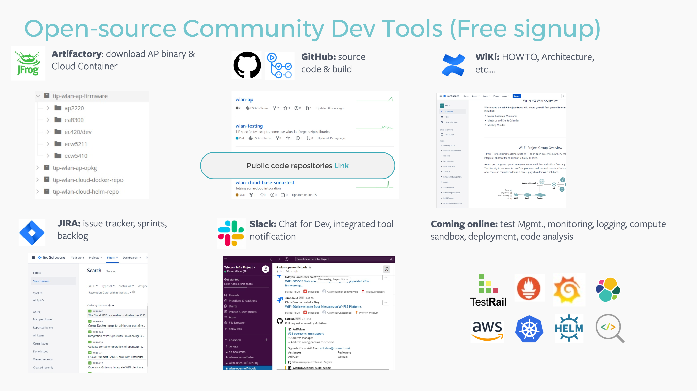
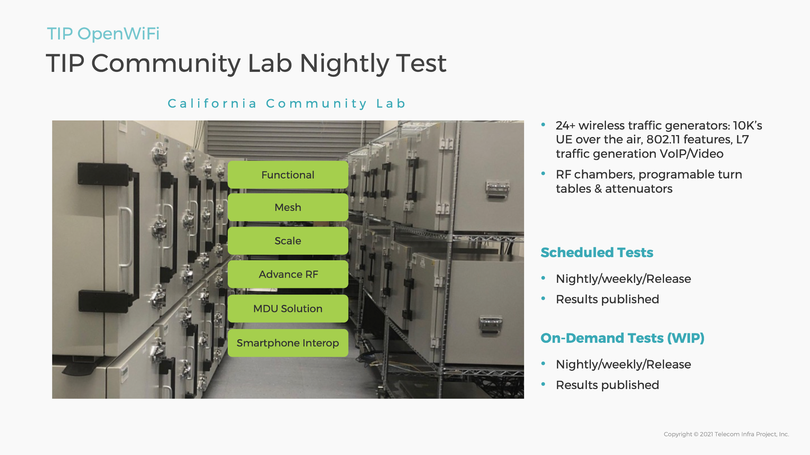

# Overview

The TIP OpenWiFi SDK micro services and the AP network operating system (AP NOS) firmware enable many use cases. With TIP OpenWiFi, the entire 'stack' from the cloud to the firmware can be consumed—lowering the cost of entry and time to market of a new entrant.

TIP OpenWiFi architecture works specifically to enable choice in device and cloud. Multiple operators have indicated legacy lock in models present with enterprise WLAN systems are lowering deployment velocity, limiting innovation and introducing artificial barriers to new market use cases.&#x20;

&#x20;

.png>)

Ensuring lock in is not present is not enough for a mass market solution. It is also necessary to provide customer choice in the cloud whether that customer is the operator or an end user.

.png>)

TIP OpenWiFi offers choice in cloud provider of managed Wi-Fi services. Deployed OpenWiFi based APs initially connect to the internet, dynamically determine the management cloud that will control their operation. If at a later stage it is desired to change the management cloud provider to another operator, OpenWiFi base devices may be redirected to any other TIP OpenWiFi ready cloud.&#x20;

This enables multi-vendor device and cloud options given TIP OpenWiFi architecture of common data model and interface for provisioning and telemetry with mutual TLS security.

## Cloud or On-Premises

As operators of many sizes, service and network complexities require more Open Source options in their production environments, TIP OpenWiFi presents the opportunity to deploy managed Wi-Fi services either from the cloud or on premises.

## Security

In the TIP OpenWiFi solution, all devices may be registered to any TIP OpenWiFi cloud. This is achieved using a unique certificate per device and a first boot process that discovers the serving cloud for the device. TIP works with Digicert, the industry leader in digital security signing infrastructure to ensure a globally redundant and available registrar for TIP OpenWiFi members. The presence of these unique device trust certificates enables a variety of advanced Zero Touch features beyond discovery including device provisioning, mesh, and wireless distribution link onboarding and more.

## Quality and Development—Continually

The OpenWiFi team implemented a Continuous Integration / Continuous Deployment (CI/CD) development pipeline that integrated feature development with continuous builds. Recognizing a large factor for operators is the break-fix cycle common in network vendors, OpenWiFi continuous builds are automated into a Quality Assurance (QA) pipeline.

At this time, 1,500 nightly tests exercise sanity for all builds of AP NOS and the cloud SDK across the majority of OpenWiFi hardware portfolio.

