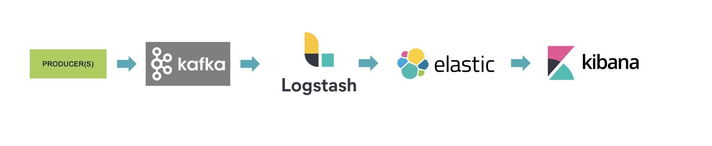
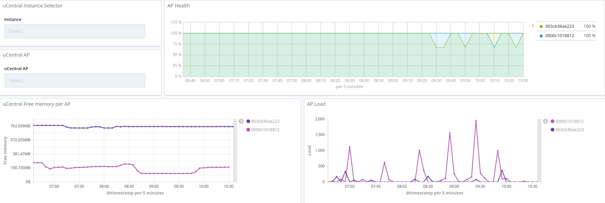
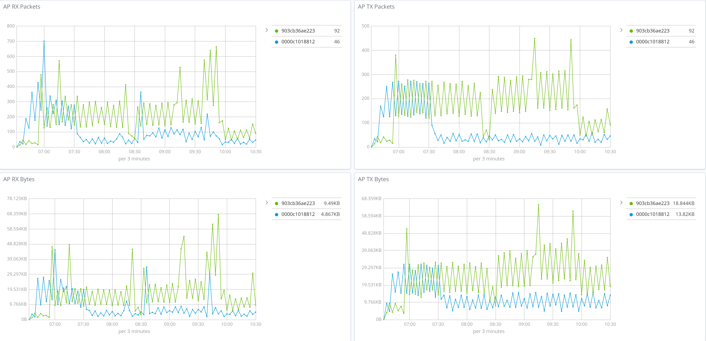

# ELK Integration

The following pipeline is used to leverage Kafka messages being emitted from OpenWiFi 2.0 for ELK (Elastic Logstash Kibana) stack integration :

TIP OpenWiFi project has deployed an ELK stack for community members to access [here](https://kibana.lab.wlan.tip.build).

The key for this integration is to use a plugin that enables Kafka to be used as an input for Logstash. This plugin can be found [here](https://www.elastic.co/guide/en/logstash/current/plugins-inputs-kafka.html). Once installed then Logstash can be configured to listen to the input source of the Kafka broker that is deployed as part of OpenWiFi SDK 2.0 release and its appropriate topics. Here is a [sample](https://github.com/Telecominfraproject/wlan-cloud-ucentral-analytics) Logstash configuration.

It is important to note that Logstash provides the ability to transform messages which then can be pushed to Elasticsearch for storage with effective indexing. Finally Kibana is used to create visualization such as this:

The following [repository](https://github.com/Telecominfraproject/wlan-cloud-ucentral-analytics) will be used to store necessary files for integration examples for monitoring.
