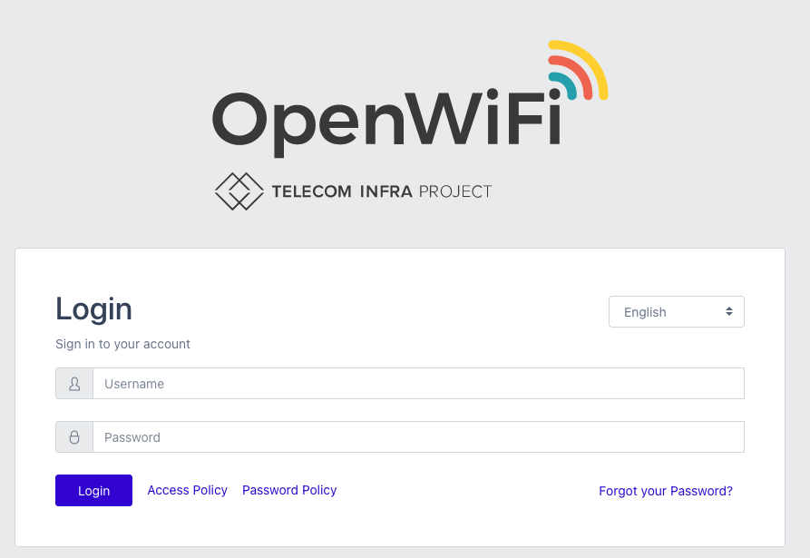
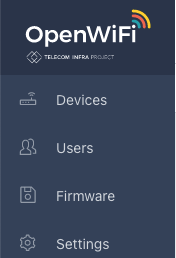
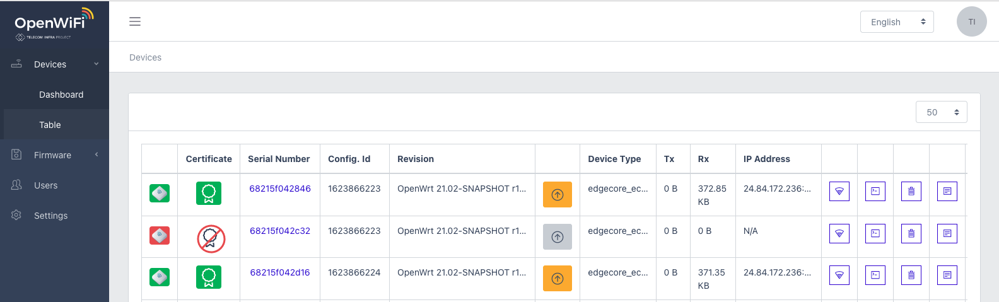
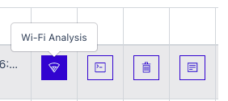
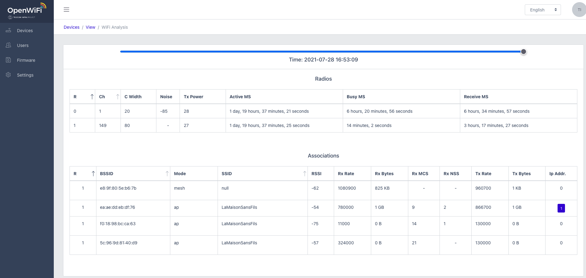
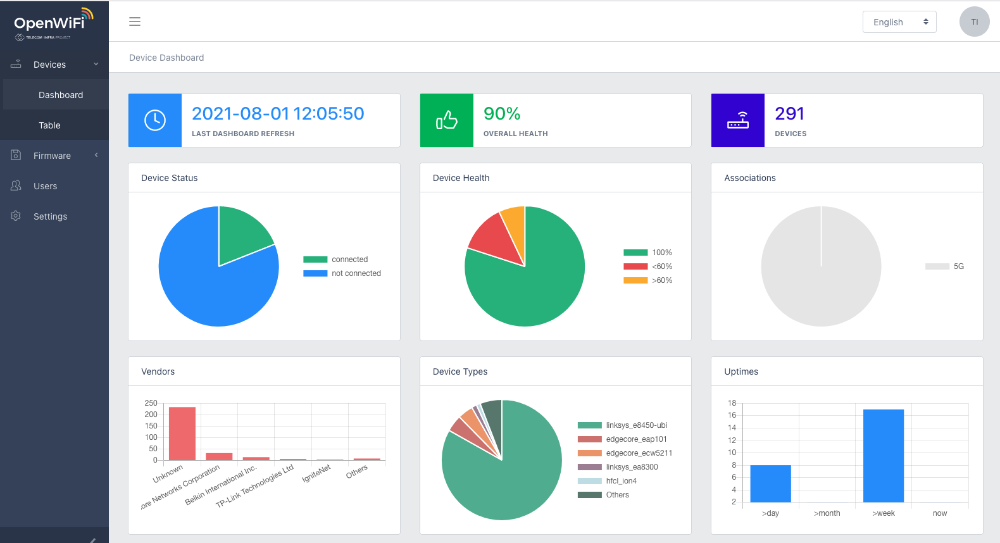
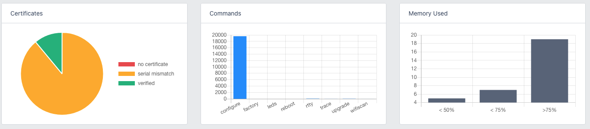

# User Interface

Release 2.0 uses a Single-Page Application \(SPA\) as an example user interface built using React to demonstrate several interactions using the northbound OpenAPI. 

### Login to OpenWiFi SDK

Default username is: **`tip@ucentral.com`** and password is: **`openwifi`**

### **Base Navigation**

A left side navigation menu provides direction to major feature or service settings. 

### Internationalization

OpenWiFi 2.0 SDK supports multiple languages. Simply select the desired language from the right drop down for pages to re-populate accordingly. 

### Devices

Upon login the first page presented is a Devices table. This table reflects all discovered and managed devices known by the OpenWiFi SDK.

Devices table indicates device Connected or Disconnected state in the first column with green and red respectively.

Certificate column indicates invalid, valid with mismatch serial, or valid device certificate identity state as red crossed seal, yellow seal and green seal respectively.

Serial Number column links to the device record. 

Compatible model, Tx, Rx, and connected IP Address present basic information of the device type and its connection. 

Three final columns provide Details \(also obtained by selecting the serial number\), Wi-Fi Analysis presenting current Wi-Fi associations and their performance and Refresh commands.   

### Displaying Associations

From the Devices table, second from right column icon the WiFi Analysis may be accessed. This may also be accessed within the Device View page of a single record along the top right of Statistics section. 

Within the WiFi Analysis page, all active associations are displayed with the ability to view approximately the last 30 minutes of data reported from the Access Point. 

For each association the device MAC address, mode of connection and SSID are displayed. This will include end devices as well as Wi-Fi infrastructure such as WDS and Mesh associations. 

Associations have RSSI, Rx Rate & Bytes, Tx Rate & Bytes, MCS negotiated, Number Spatial Streams and IP Address information.   

### Dashboard View

OpenWiFi SDK provides visual indications on the overall health of the deployed Wi-Fi network. this includes Device Status for connected and non-connected devices. Device health indicating percentage of devices failing a health check. Distribution of devices by vendor in the network and by model. 

Additionally, verified certificates or serial mismatch certificates, number of Command actions from all Gateways to devices and devices with greater than 75% memory utilization, greater than 50% less than 75% memory and less than 50% utilization are displayed. 

