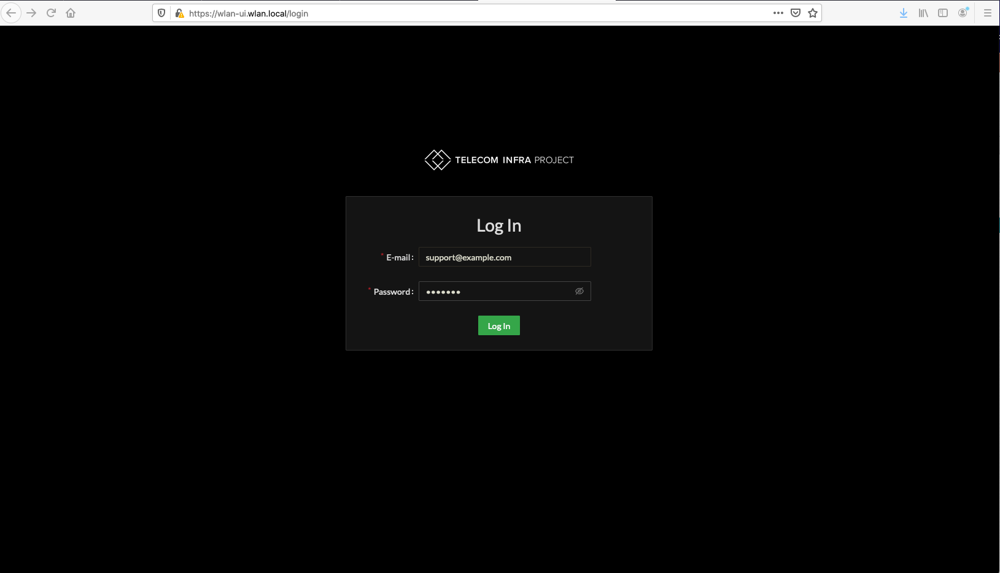

# User Interface

## Navigating the UI

TIP open source SDK offers a web based user interface supporting many common configurations. The web based interface uses the SDK north bound API.   
  
It is possible to further extend functionality of the SDK user interface or to create other interfaces using the SDK API.   

### Log In 

Default user account is `support@example.com` with password `support`. 

If using the self-signed certificates provided in the open source distribution, it will be necessary to add an exception to the web browser for the following URLs:

* [https://wlan-ui.wlan.local/login](https://wlan-ui.wlan.local/login) 
* [https://wlan-ui-graphql.wlan.local/](https://wlan-ui.wlan.local/login)

Further instructions available [here](../getting-started/controller.md).

