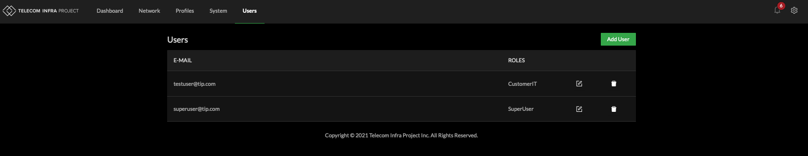
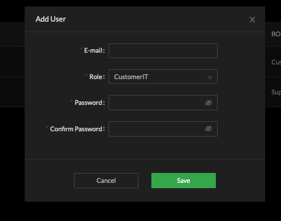

# Accounts

Cloud SDK local accounts support user interface and API connections. Adding and removing accounts from the web user interface may be completed from the Users navigation tab. 

Select `'Add User'` to create a new Cloud SDK user, assign a Role and password. 

