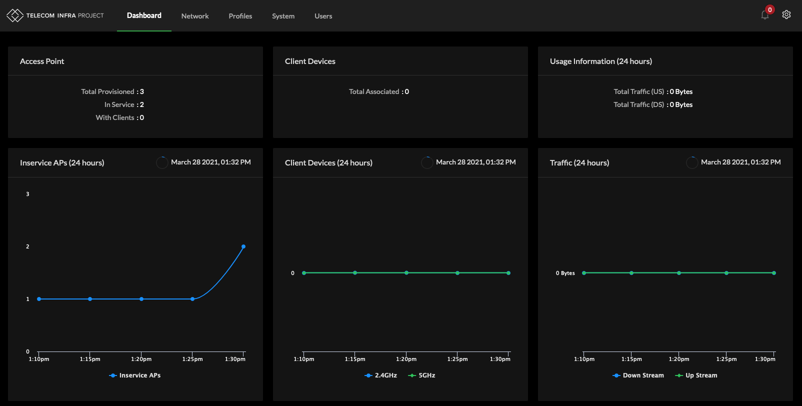

# Dashboard

TIP Cloud SDK is organized into main components presented along the top of the screen.

Dashboard is the default landing page for the user interface.  
Network enables management of Access Points and display of Client Devices status.  
Profiles enables template based management of all provisioning parameters.  
System enables Manufacturer OUI Updates, Firmware Updates, Auto-Provisioning and Client Block List.  
Users enables configuration of local user accounts of the Cloud SDK.  
Alarm indicates an error condition has occurred with one or multiple Access Points.  
Gear icon to Log Out.

## Dashboard Components

<table>
  <thead>
    <tr>
      <th style="text-align:left">Component</th>
      <th style="text-align:left">Description</th>
    </tr>
  </thead>
  <tbody>
    <tr>
      <td style="text-align:left">Access Point</td>
      <td style="text-align:left">
        
Total Provisioned Access Points

        
In Service Access Points ( Actively Reporting )

        
With Clients ( Actively Reporting and with Associated Wi-Fi Devices )

      </td>
    </tr>
    <tr>
      <td style="text-align:left">Client Devices</td>
      <td style="text-align:left">
        
Total Associated as a numeric total of associated Wi-Fi clients

        
5GHz as a numeric total of associated Wi-Fi clients over 5GHz

        
2GHz as a numeric total of associated Wi-Fi clients over 2GHz

      </td>
    </tr>
    <tr>
      <td style="text-align:left">Usage Information</td>
      <td style="text-align:left">24 Hour Report of total bandwidth Upstream and Downstream across all Access
        Points</td>
    </tr>
    <tr>
      <td style="text-align:left">Inservice APs</td>
      <td style="text-align:left">24 Hour line graph of Actively Reporting Access Points</td>
    </tr>
    <tr>
      <td style="text-align:left">Client Devices</td>
      <td style="text-align:left">24 Hour line graph of Associated Wi-Fi Client Devices</td>
    </tr>
    <tr>
      <td style="text-align:left">Traffic</td>
      <td style="text-align:left">24 Hour line graph of Total Traffic Upstream and Downstream</td>
    </tr>
    <tr>
      <td style="text-align:left">AP Vendors</td>
      <td style="text-align:left">Pie Chart graph of AP Vendors by Organizational Unique Identifier</td>
    </tr>
    <tr>
      <td style="text-align:left">Client Vendors</td>
      <td style="text-align:left">Pie Chart graph of Client device Vendors by Organizational Unique Identifier</td>
    </tr>
  </tbody>
</table>

