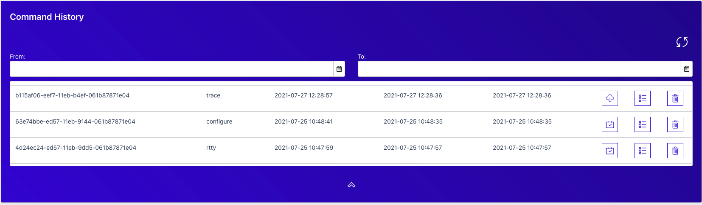
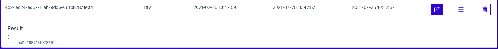
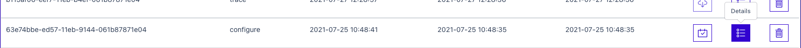

# Command History

Multiple events are recorded in the Command History tile. Each line item will have a Result, Details, and Delete action.

When an rTTY session is executed, this is a displayed command history. Selecting the Result icons will display the Success or Fail of the command.

Each provisioning event is reflected as a configure command history. To see the entire JSON payload and the result, including success or error with message, simply select Details to expand the dialog below with this data. A date and time in the third column indicates when the configure command was executed successfully.

If a provisioning event has failed to complete, its command history for configure will show as pending.

Remote packet capture is shown as the trace command history. When packet captures are persisted in the OpenWiFi SDK, they may be downloaded again through the cloud download icon.

