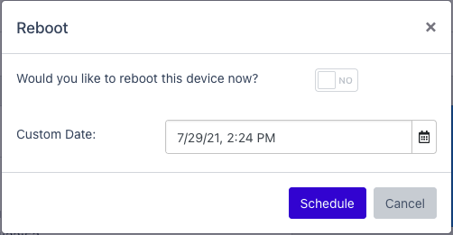
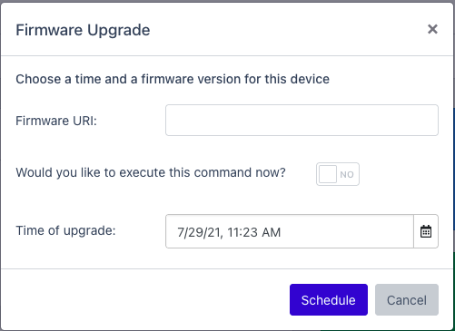
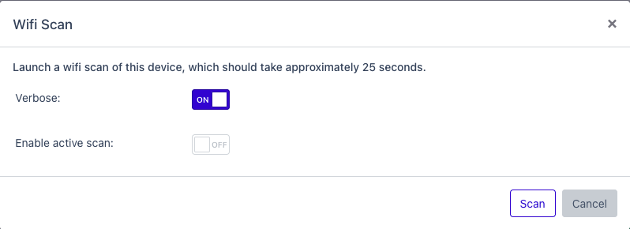
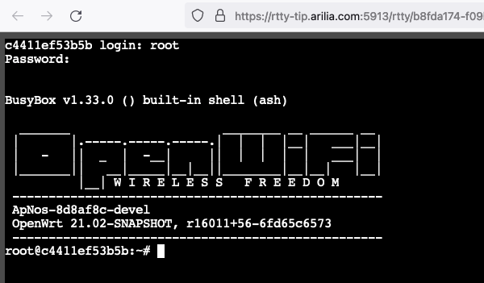
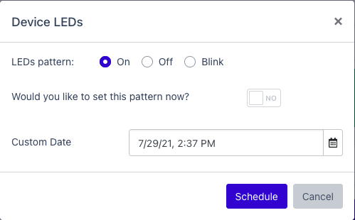
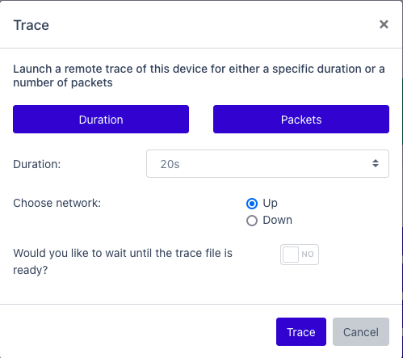
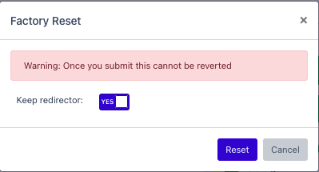
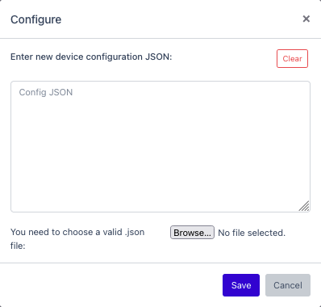

# Commands

Within the devices view, the Commands tile offers a number of features and administrative actions.\
Each of these represent API calls exposed on the OpenAPI northbound interface from the SDK.

## Reboot

Selecting the Reboot action will prompt the below dialog. Options presented permit an immediate reboot or a scheduled reboot based on date and time.

## Firmware Upgrade

Multiple methods exist to execute a remote Firmware Upgrade of a device. When selecting Firmware Upgrade via the Commands tile, a simple dialog to upgrade immediately or at a scheduled time is presented. Alternatively using the Firmware Management Service provides a complete solution including managed access to all TIP firmware images.

## Wi-Fi Scan

OpenWiFi devices may perform channel scanning and return this neighbor and RF data to the SDK in an on demand or ongoing manner.

### Wi-Fi Scan Results

Scan operations function over all channels. If 5GHz channels do not display in the returned results ( either via the UI or over API ) this indicates the device is configured in a DFS channel for which it may not return survey scans at this time.

## Connect

OpenWiFi enables remote connection to any managed device using rTTY encrypted shell session. Selecting Connect will cause a browser tab to open with the login session to current device.

## Blink

To assist with remote identification of devices in the network, it is possible to turn the LED lights On, Off, of continuous blinking. This may be run on-demand or scheduled.

## Trace

Trace feature enables a remote packet capture to occur on the managed device, over a specified period of time or amount of traffic, returning the "pcap" packet capture file locally to the OpenWiFi admin user.

Once complete the user is asked to open or save the packet capture file locally.

.png>)

## Factory Reset

It is possible to revert a device to initial out of box state from the OpenWiFi SDK. Sending a Factory Reset will remove all configuration on the device and optionally reset the discovered cloud stored as the 'Redirector' in the device configuration.


Note: When Redirector is not kept, devices will re-contact the Certificate Authority to re-discover their OpenWiFi cloud address


## Configure

Prior to the introduction of OpenWiFi 2.0 Provisioning Service, device configuration is done through creation of the JSON provisioning file and either loading that file or applying its contents using the dialog presented via Configure. The same options exist when using the API directly.

