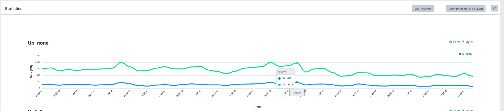
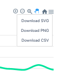
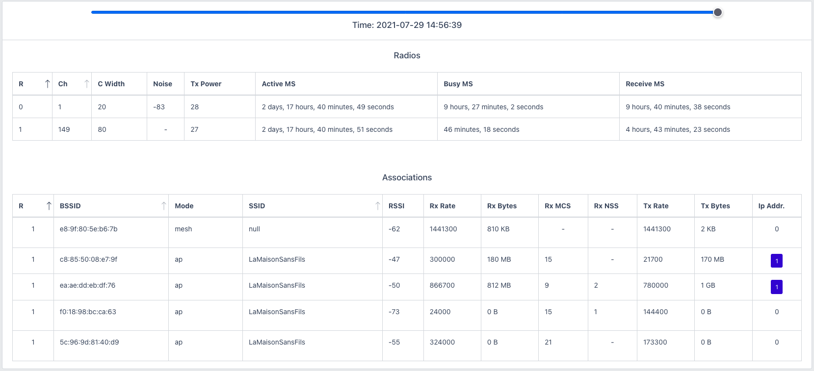
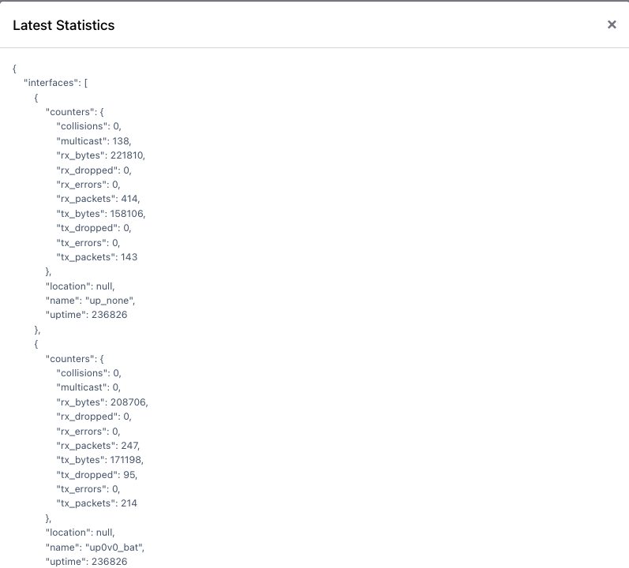

# Statistics

Each device page presents statistics in traffic terms per interface as a line graph of bandwidth over time.

The generated image may be downloaded for offline use.

Accessing Wi-Fi Analysis and Last Statistics may be found at the top right of Statistics tile.

## Wi-Fi Analysis

Operating channels, channel width, noise floor and transmit power are the first values reported in Radios table.

Viewing associations, from the Associations table, and their use is important in terms of bandwidth and connection quality. Wi-Fi Analysis helps visualize each client association, this could be an end user device or a WDS or Mesh association.

Each association is known by their MAC address or BSSID value. The mode of connection will indicate if an end user client device entering the "ap" or if a client is associated as "wds" or "mesh.

The access point view of RSSI, Rx and Tx Rate, Modulation Coding Scheme and Number of Spatial Streams are exposed for each association.

Using the slider along the top, the last 15 to 30 minutes of performances data may be viewed.

## Latest Statistics

The option to view Latest Statistics is at time of the MVP release, intended to help the Community see on a per device basis how much, or how little depending on device configuration, is being sent to the OpenWiFi Gateway in terms of telemetry.

