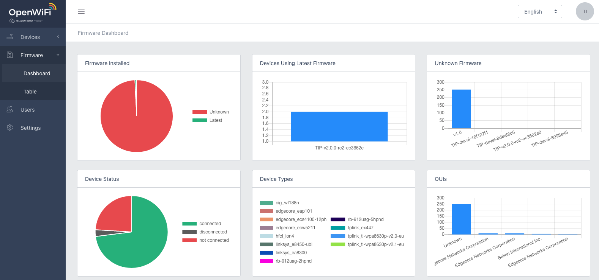
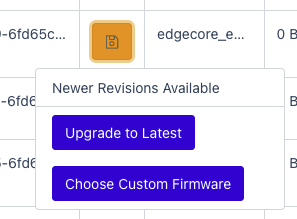
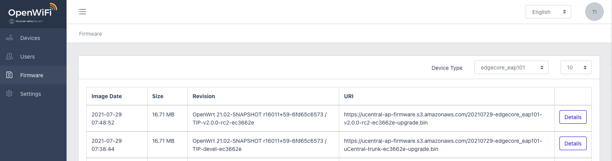
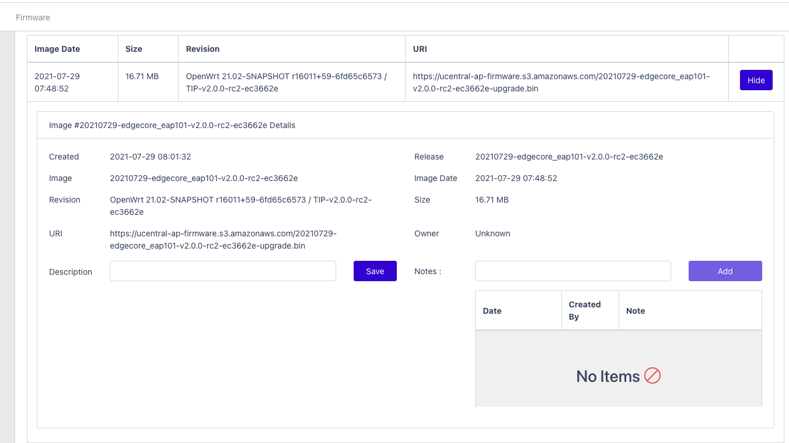

# Firmware

Firmware management service integrates across all OpenWiFi Gateways deployed in a cluster enabling updates to running firmware either from the latest published version, or any other released version. 

### Dashboard

Firmware dashboard provides a single view for overall health of deployed device firmware. Latest firmware charts, device  firmware version distribution, distribution of device by type and current connected devices.

### Device Table

From the Devices table, any device with a newer firmware published by TIP OpenWiFi is indicated with a yellow icon. Selecting this icon presents the option to upgrade to latest or specify which firmware to use. 

When the upgrade has been sent successfully, a green Success dialog will display in the upper right of the screen. Devices with latest firmware version will show a green firmware icon in the Devices row. 

### Firmware Management Service

Viewing the contents of Firmware Management Service is available from the left navigation, select Firmware. 

Once in Firmware, it is possible to search by device model for all known firmware revisions. 

If in the Device Table reference above,  instead of selecting Upgrade to Latest, the specific URI location of any available firmware is found using the Firmware table. 

Selecting Details will present information for any firmware row, including the URI which may be copied into the Choose Custom Firmware dialog prompt accordingly. 

