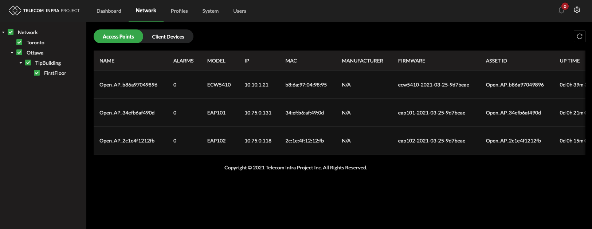
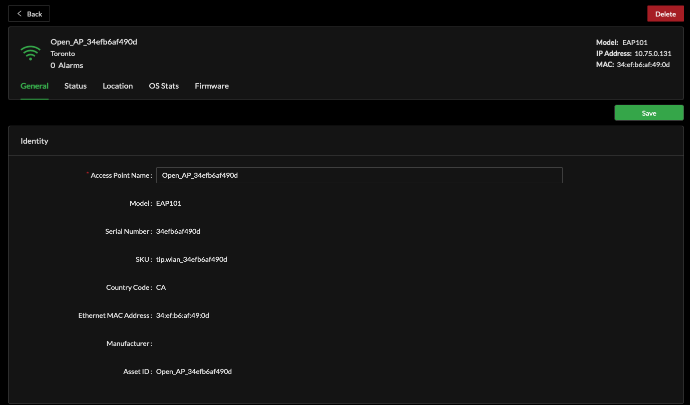
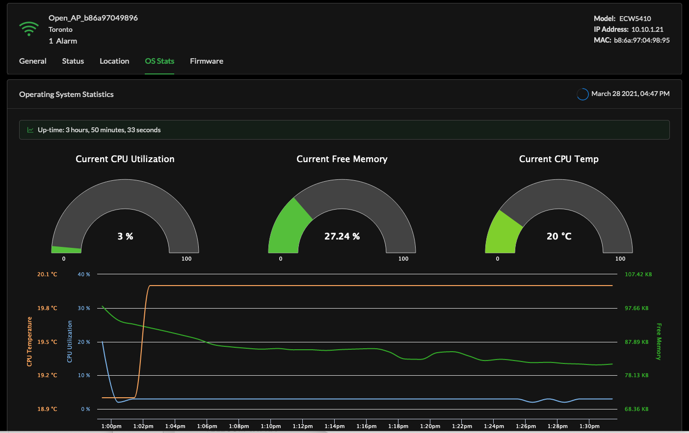
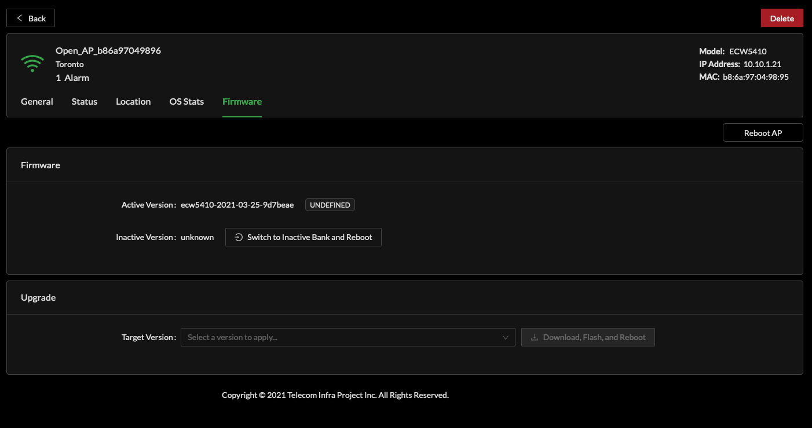

# Network

From the Network page it is possible to create organizational regions to group devices within, view all devices, retrieve individual device records and view all associated and disassociated client devices.

## Location Tree

In a future release it will be possible to assign devices to new locations to help in building an administrative hierarchy supporting convenient organization of device to service location. This functionality is exposed in the API and may be further refined in subsequent open source UI releases.

## Access Points

For each access point that has contacted Cloud SDK, a row will populate within Access Points.  
Specific information for each device including Device name, alarm state, model and IP address are shown.

Along the right side of each Access Point row are Profile, Channel, Occupancy, Noise Floor and Devices.  
Channel indicates the current provisioned RF Channel for each radio in the device.  
Occupancy indicates available RF bandwidth for Wi-Fi clients as a value over 100.  
Noise Floor represents the reported RF noise condition being measured by the device within the operating channel and reported to the Cloud SDK.  
Devices indicated the total associated clients for each radio in the access point.

### Access Point Device Record

Each access point managed by Cloud SDK inherits provisioning information from Profiles in addition to supporting device specific configurations and reporting device specific operating conditions.

General information includes device name, model, MAC address and country of operation.  
Status presents operating conditions for each frequency band of operation in addition to Alarms.  
Location permits the assignment of the device to a location in Cloud SDK hierarchy tree.

### OS Stats

Operating System Stats are sent to Cloud SDK from each device using the MQTT interface. These statistics are regularly received as part of the overall telemetry stream.

### Firmware

The Cloud SDK may initiate an on demand firmware upgrade for any associated device. The Active Version of firmware is reported to the Cloud SDK. If the reported version from the device is not part of the System known firmware, the status will be `'UNDEFINED'`.

Several TIP devices implement a secondary boot loader bank which Cloud SDK supports the method to command a device to `'Switch to Inactive Bank and Reboot'` .

To initiate a firmware upgrade, select a version from the drop down within Upgrade, select the `'Download, Flash, Reboot'` button.

### On-Demand Device Reboot

Within the Firmware sub-tab, Reboot AP button. Selecting this will cause Cloud SDK to send a warm reboot command to the Access Point.

