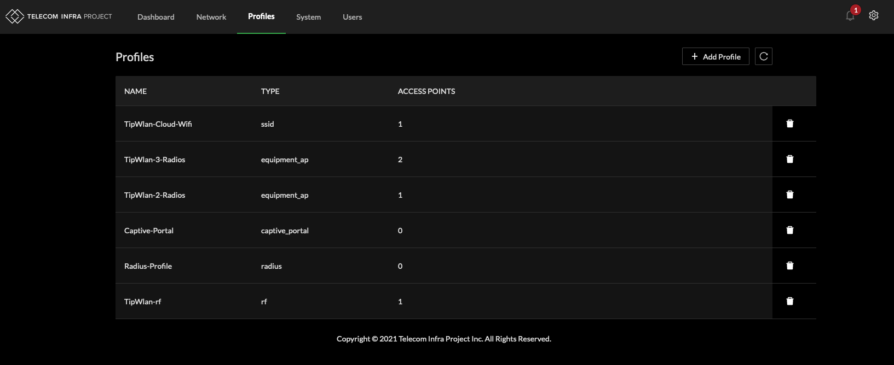

# Profiles

Cloud SDK uses multiple templates to perform provisioning of Cloud SDK managed devices.

Sample default templates are provided on initial startup of Cloud SDK.

## Templates

| Type | Role |
| :--- | :--- |
| RF | Radio Frequency configuration parameters |
| SSID | Service Set Identifier |
| RADIUS | Authentication Authorization Accounting Configuration per SSID |
| Equipment AP | 1:1 or 1:Many Device Association to RF Profile and SSID |
| Captive Portal | Access Point Captive Portal configuration parameters |
| Passpoint | R1 & R2 Compliant IEEE 802.11u configuration parameters |
| Passpoint ID Provider | R2 Compliant Offload, Venue, NAI and OpenRoaming configuration parameters |

