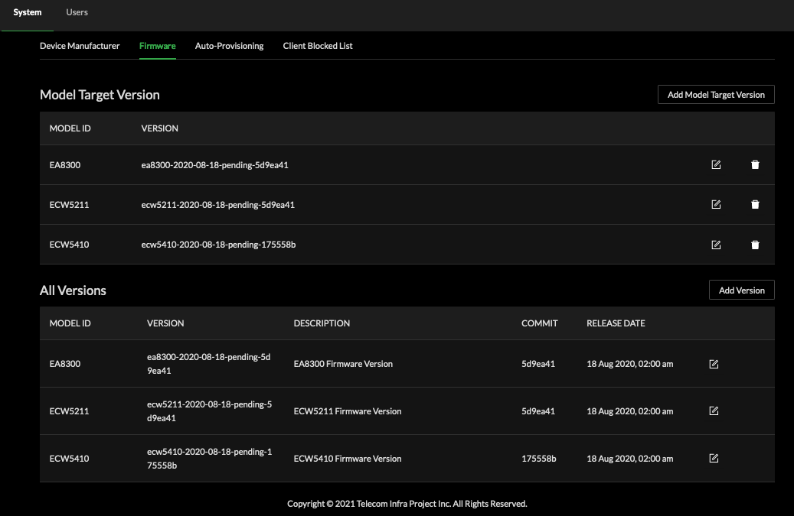

# System

Cloud SDK System configuration permits uploading OUI data file to assist with device fingerprinting as shown on the initial dashboard landing page dials. 

### Device OUI Fingerprints

Obtain the OUI file locally and upload to Cloud SDK via Device Manufacturer

### Firmware

Firmware image upgrades may be triggered from the Cloud SDK. It is necessary to populate Cloud SDK with Model Target information. If your model is not displayed select Add Model Target Version then proceed to defined a firmware version for use. 


Note a local web service should be reachable by deployed AP devices from the Fully Qualified Domain Name and file path configured in this step


Adding firmware version:

When returning to the Network and selecting an Access Point, available Firmware will be presented for actions on a per device basis.

### Auto-Provisioning

Locations defined within the Cloud SDK may be auto-provisioned by default or subject to pre-provisioning logic in the Cloud SDK. When a device associates to the Cloud SDK, a Model : Profile match will be attempted in Auto-Provisioning mode. 

### Client Blocked List

If any client should be denied access to any Wi-Fi service visible to Cloud SDK management it may be added through the global Client Blocked List. 

